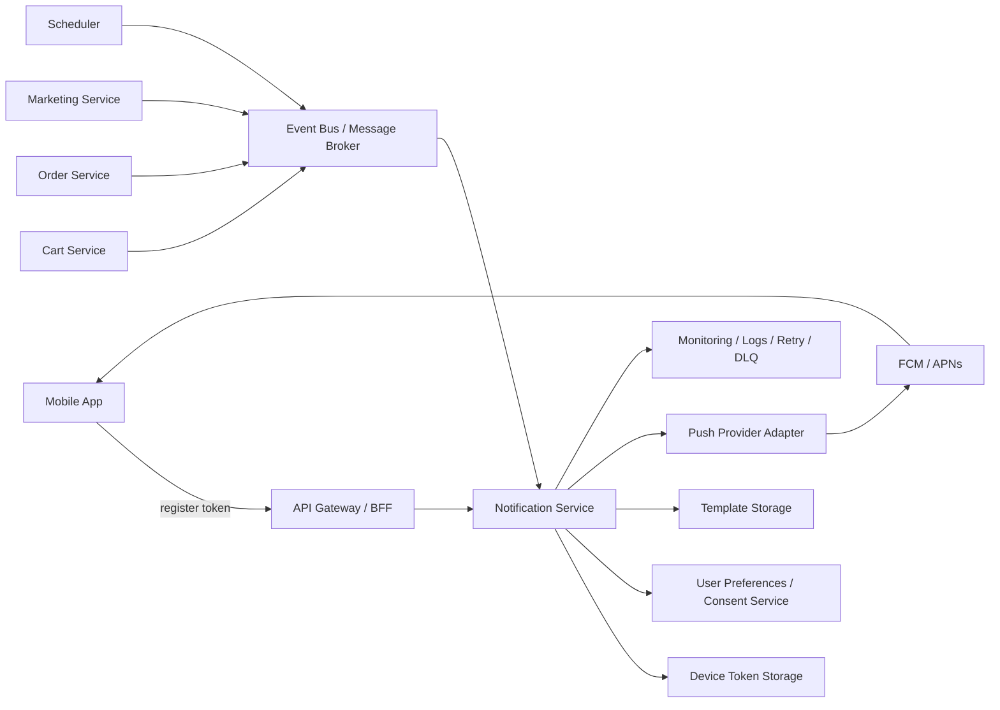

```mermaid
flowchart LR
    MA[Mobile App] -->|register token| BFF[API Gateway / BFF]
    BFF --> NS[Notification Service]
    NS --> DTS[Device Token Storage]
    NS --> UPS[User Preferences / Consent Service]

    CS[Cart Service] --> EB[Event Bus / Message Broker]
    OS[Order Service] --> EB
    MS[Marketing Service] --> EB
    SCH[Scheduler] --> EB

    EB --> NS
    NS --> TS[Template Storage]
    NS --> PPA[Push Provider Adapter]
    PPA --> FP[FCM / APNs]
    FP --> MA

    NS --> MON[Monitoring / Logs / Retry / DLQ]
```

